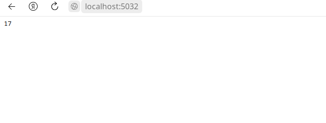

# Добавление и определение маршрутов

```csharp
app.MapControllerRoute(name: "default", pattern: "{home}/{action}");
```
Так выглядит стандартное создание маршрута. `name: "name", pattern: "{controller}/{route}"` - это параметры, где `name: "name"` - это название маршрута, а `pattern: "{controller}/{action}"` - это сам шаблон маршрута.

Если в шаблоне маршрута идут подряд несколько параметров, то между ними должен располагаться разделитель **/**.Например, если пришел запрос по пути **"/home/index/"**, то первый сегмент **"/home/"** будет проецироваться на параметр **"controller"**, поэтому будет выбран контроллер **Home**. Второй сегмент - **"/index/"** будет проецироваться на параметр **"action"**, соответственно для обработки этого запроса будет выбран метод Index контроллера Home.

Шаблон маршрута может содержать дополнительные параметры, которые можно получить через параметры метода:
```csharp
app.MapControllerRoute(name: "default", pattern: "{controller}/{action}/{id}")
```
Здесь маршрут `"default"` принимает третий параметр `"{id}"`.
Определим наш контроллер так:
```csharp
public string Index(int id) => id;
```
Запустим **localhost**, вбъем в строку **url**: `http://localhost:{...}/Home/Index/17`:


### Статические сегменты
```csharp
app.MapControllerRoute(name: "default", pattern: "default/{controller}/{action}");
```
В данном случае шаблон маршрута начинается со статического сегмента `default/`. Таким образом, этому маршруту будут соответствовать все маршруты, которые состоят из четырех сегментов, где первый сегмент равен `"/default"`, например, запрос: `http://localhost{...}/Home/Index`